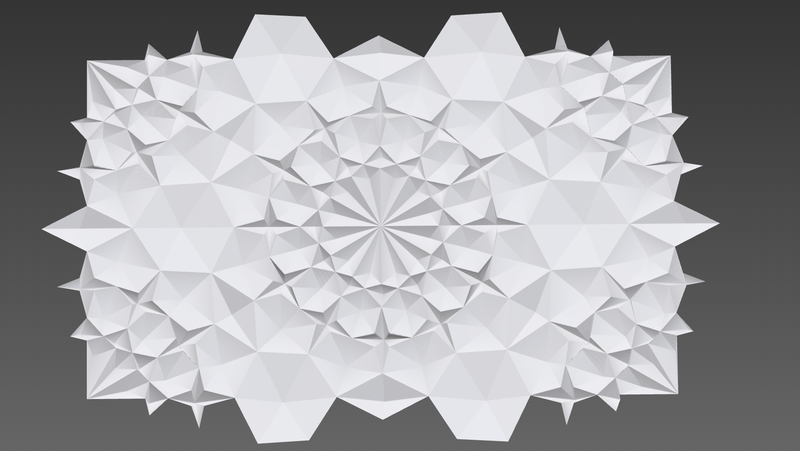

# Dynamo Challenge #2

This repository demonstrates solving [Dynamo Challenge #2](https://forum.dynamobim.com/t/dynamo-challenge-02-geometric-patterning/78884/11) using only Hypar.Elements and C#. The included `.dib` file is a C# interactive notebook using Elements, and the `/DynamoChallenge2` directory contains a Hypar Function that uses (mostly) the same code to produce a Hypar function.

You can try out the function itself here on Hypar with a free Hypar account: https://hypar.io/workflows/b787bb12-7415-45c5-b3bb-5061a60dcfc5

